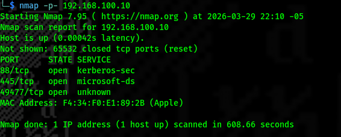
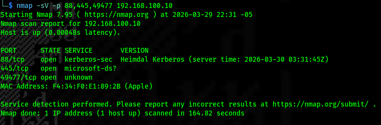
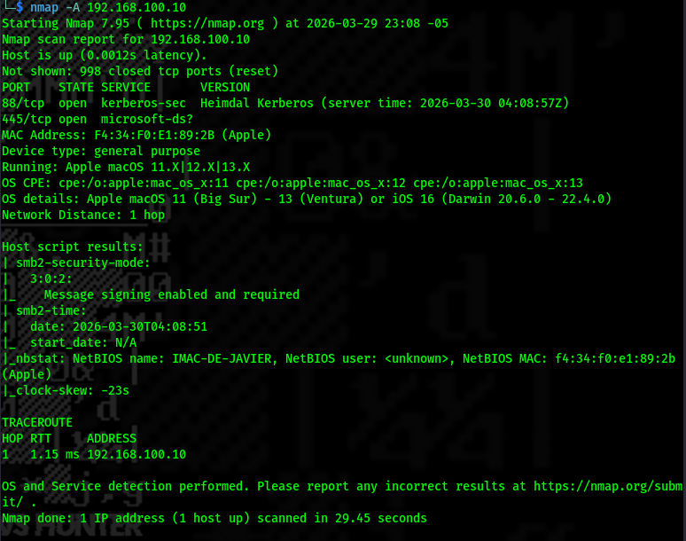
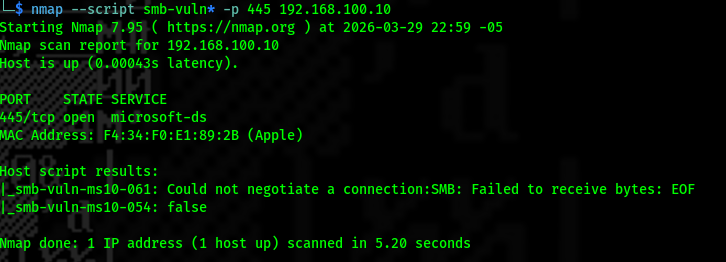

## Scan Evidence

### Full Port Scan
A complete scan of all TCP ports (1–65535) was performed to identify all open services, including non-standard ports.

---

### Service and Version Detection
Service enumeration was conducted using version detection to identify running services on open ports.

---

### Aggressive Scan
An advanced scan was executed to gather detailed information including OS detection, service details, and script results.

---

### SMB Vulnerability Scan
A vulnerability assessment was performed on the SMB service using Nmap NSE scripts. No known vulnerabilities were detected.

